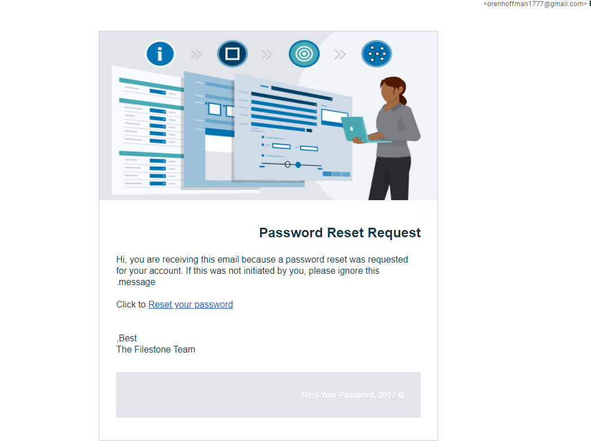
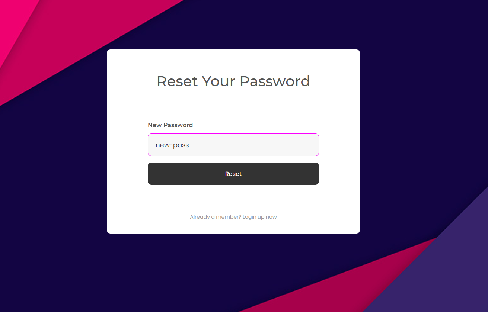

# Reset-Password-Spring-boot

This spring boot app demonstrate "Forgot my password" flow.

After submitting the form an email will be sent to the mail address the user provided, an access token will be generated and will be kept in a map registry with the user object,
Access token lifetime is only 5 minutes for security purposes.

In this email the user will be redirected to the reset-password HTML page . The access token will be added to the HTML "Reset your password" as a query parameter for authentication.

When the user will try to rest the password, the "isEligible" method will authenticate the access token the user came with.
When authenticated (token lifetime still valid and its the same token), the new password will be hashed with SHY-2 algorithm and updeted in the database.

SPRING BOOT - FORGOT MY PASSWORD APP :#SPRING BOOT, #JPA repository,#Embedded H2, #MAVEN, #SHY-2,#JAVA Mail, #AngularJs, #HTML

*PLEASE NOTE --- > In order to send the 'Forgot My Password' email you will need to provide your own email username and password parameters in the 'email properties' file othrwise the javax mailer will be disabled 

To access the application build and run project as a spring boot app
and then hit this endpoint --> http://localhost:8090 in the browser

## Images

@For any questions you can send an email to orenhoffman1777@gmail.com

